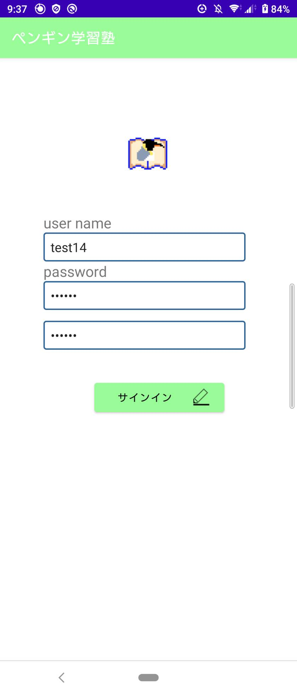

# ペンギン学習塾

## 製品概要
### 背景
何かを勉強するとき、または面倒臭い作業をこなすとき、そこには相当な熱量がないと中々長続きしません。世の中にはモチベーションを保つために今までの作業時間を管理し、達成感を得るようなアプリが多く存在します。私たちはそこに育成ゲームの要素を取り入れることで、よりモチベーターとしての機能を高めたいと考えました。
>人にやる気（モチベーション）を起こさせ行動を促す要因、という意味で用いられることのある語。人を鼓舞してやる気を出させることに長けた人物、人に行動を促すための技術や知識を持った人物を指して用いられることが比較的多い。
>https://www.weblio.jp/content/モチベーター
### 製品説明
勉強時間を管理しつつモチベーターの役割をこなします。使用者は自身の用途によってタグを作成し、タグごとに作業時間を管理することができます。作業することによって使用者は餌を取得することができます。そこで得た餌をペンギンに与えて育てることができます。また、他のユーザーと作業時間を比較することができます。
### スクリーンショット
  

### 特長
#### 1. 育成ゲーム
従来の同様アプリであまり用いられない育成ゲームによって、より勉強/作業をする理由付けをします。
#### 2. ストップウォッチからの入力
ストップウォッチで自身の作業時間を計測し、そのまま入力することが可能です。
#### 3. ランキング機能
他ユーザの作業時間を確認することができます。これもまたモチベーターとなります。

### 解決出来ること
気の進まない作業ややらないといけない勉強に対して、楽しみ/モチベーションを提供します。
### 今後の展望
* StudyテーブルとTag テーブルの連携
Tagの編集を後から実装したため、Studyテーブルとの連携をtag_nameで行ってしまっている。エラーが起こる可能性があるために今回は放置したが、tag_idで連携させる。
* ペンギンの成長フェーズ
* セキュリティ強化とエラー対応
現在はパスワードを平文で保存してしまっている
### 注力したこと（こだわり等）
* ペンギンの動き
レヴィウォークを導入し、より動物的な振る舞いをします。また、餌に対しては直線的に移動して食事をします。

## 開発技術
### 活用した技術
#### API
* ユーザの勉強時間を管理するAPI

#### フレームワーク・ライブラリ・モジュール
* android studio
* ruby on rails

#### デバイス
* androidデバイス

